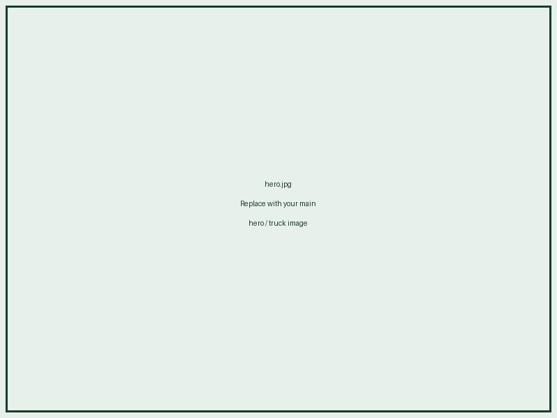

# Cartr Website – Setup Guide

## Files
```
cartr-website/
├── index.html     ← Main landing page
├── legal.html     ← Legal docs (fetches from Supabase)
├── contact.html   ← Contact page
├── config.js      ← ⚠️  Fill in your Supabase credentials
└── assets/        ← Create this folder and add your images
```

---

## Step 1 – Add Your Supabase Credentials

Open `config.js` and replace the placeholder values:

```js
const SUPABASE_CONFIG = {
  url:     "https://your-project.supabase.co",
  anonKey: "your-public-anon-key"
};
```

Find these at: Supabase Dashboard → Settings → API

---

## Step 2 – Add Your Images

Create an `assets/` folder and add:

| File                  | Used In         | Description                    |
|-----------------------|-----------------|--------------------------------|
| `logo.png`            | Navbar          | Logo on white background       |
| `logo-white.png`      | Footer          | Logo on dark green background  |
| `hero.jpg`            | Hero section    | Main hero image (truck/delivery)|
| `problem.jpg`         | Problem section | Logistics challenges image     |
| `map.jpg`             | Coverage section| Pune coverage map image        |

Then uncomment the `` tags in each HTML file and remove the placeholder `<div>` beneath them.

**Example in index.html (hero):**
```html
<!-- Remove this placeholder div -->
<div class="hero-img-placeholder">...</div>

<!-- Uncomment this -->

```

---

## Step 3 – Legal Documents in Supabase

Make sure your `legal_documents` table has rows with these `type` values:
- `terms_and_conditions`
- `privacy_policy`
- `customer_terms_and_conditions`
- `refund_and_cancellation_policy`

Each row needs `is_published = true` to appear on the website.

Content supports basic Markdown:
- `# Heading 1`, `## Heading 2`, `### Heading 3`
- `**bold**`
- `- bullet` or `1. numbered list`
- `---` for horizontal rule
- `> blockquote`

---

## Step 4 – Deploy

This is a static site — no build step needed. Deploy to:
- **Vercel** – drag and drop the folder
- **Netlify** – drop folder on netlify.com/drop
- **GitHub Pages** – push to a repo and enable Pages
- **Any web host** – upload the files via FTP/cPanel

---

## Contact Form Note

The contact form uses `mailto:` which opens the visitor's email client — this is intentional for the MVP (no backend needed). When you're ready, you can replace `handleSubmit()` in `contact.html` with a proper API call (e.g. EmailJS, Formspree, or a Supabase Edge Function).
