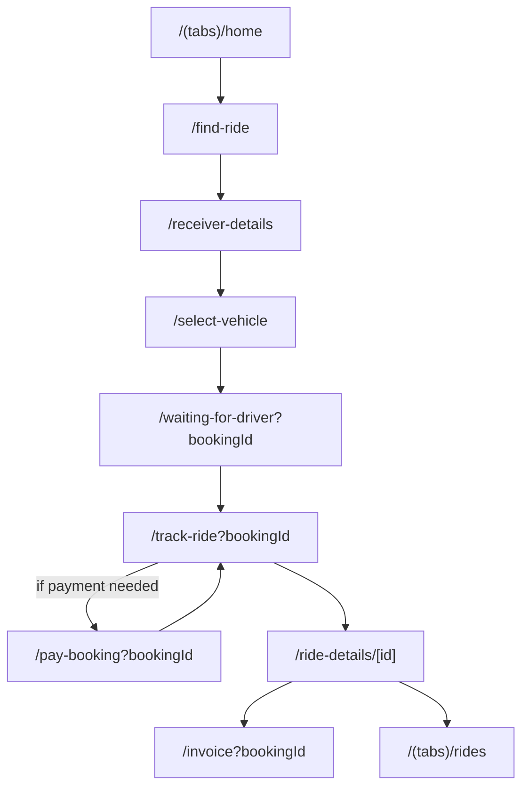
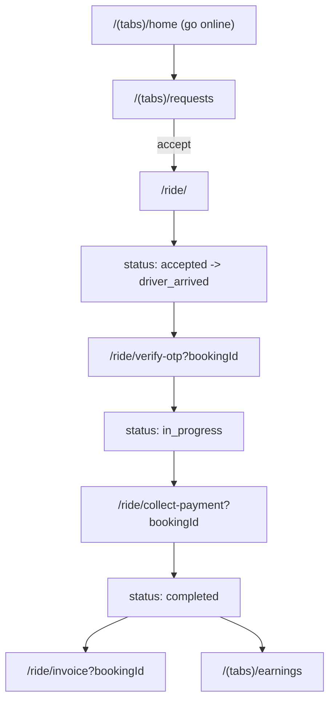
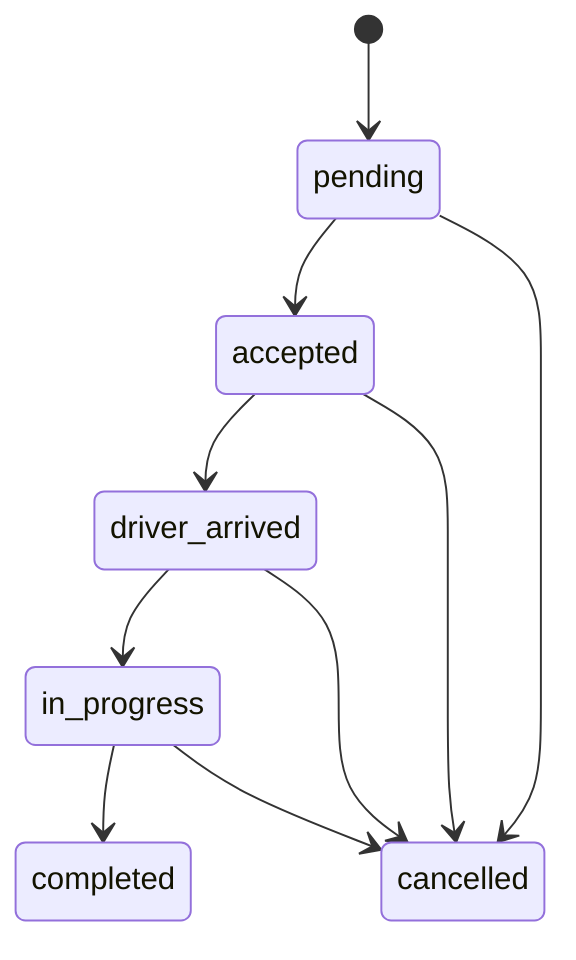

# Cart-R Customer + Driver UI/UX Audit (Code-Based) + Happy-Path Flows

Last updated: 2026-03-12

This is a **code-based UI/UX audit** of the **Customer** and **Driver** apps in this repo. It focuses on the **end-to-end booking lifecycle** (create booking → matching → pickup/drop OTP → tracking → payment → completion → invoice/history).

Notes / limitations:
- Findings are grounded in the current Expo Router screens and the booking/payment state types, but this is **not** a pixel-perfect visual review (no screenshots/usability tests).
- Where the code suggests multiple behaviors (fallbacks, edge-handling), this audit flags UX risk and recommends a single clear behavior.

---

## Severity rubric (P0–P3)

- **P0 (Blocker):** Prevents completing core flow (book, track, pay, complete) or traps the user without recovery.
- **P1 (Major):** Likely to cause confusion, abandonment, or repeated support tickets.
- **P2 (Friction):** Noticeable usability issues; slows users down; inconsistent or unclear.
- **P3 (Polish):** Visual/copy/accessibility improvements; low risk but improves perceived quality.

---

## Source of truth

### Customer app
- Routes/screens: `apps/customer/app/**`
- Booking type/state: `apps/customer/types/type.d.ts`
- Root navigation: `apps/customer/app/_layout.tsx`

### Driver app
- Routes/screens: `apps/driver/app/**`
- Booking type/state: `apps/driver/lib/bookings.ts`
- Root navigation: `apps/driver/app/_layout.tsx` (and `apps/driver/app/(tabs)/_layout.tsx`)

---

## Route inventory (booking lifecycle scope)

### Customer auth/entry routes (prerequisite)
- /welcome (file: apps/customer/app/welcome.tsx)
- /sign-in (file: apps/customer/app/sign-in.tsx)
- /register (file: apps/customer/app/register.tsx)

### Customer routes used in lifecycle
- Home entrypoint: `/(tabs)/home` (file: `apps/customer/app/(tabs)/home.tsx`)
- Location selection: `/find-ride` (file: `apps/customer/app/find-ride.tsx`)
- Receiver details: `/receiver-details` (file: `apps/customer/app/receiver-details.tsx`)
- Vehicle + addons + payment choice + booking create: `/select-vehicle` (file: `apps/customer/app/select-vehicle.tsx`)
- Matching / retry: `/waiting-for-driver?bookingId=...` (file: `apps/customer/app/waiting-for-driver.tsx`)
- Live tracking + OTP display + pay entry: `/track-ride?bookingId=...` (file: `apps/customer/app/track-ride.tsx`)
- Payment screen (if needed): `/pay-booking?bookingId=...` (file: `apps/customer/app/pay-booking.tsx`)
- Post-trip details + rating + invoice link: `/ride-details/[id]` (file: `apps/customer/app/ride-details/[id].tsx`)
- Invoice: `/invoice?bookingId=...` (file: `apps/customer/app/(stack)/invoice.tsx`)
- History entrypoint: `/(tabs)/rides` (file: `apps/customer/app/(tabs)/rides.tsx`)
- Wallet entrypoint (referenced during booking/payment): `/(tabs)/payment` (file: `apps/customer/app/(tabs)/payment.tsx`)

### Driver auth/onboarding routes (prerequisite)
- /sign-in (file: apps/driver/app/sign-in.tsx)
- /onboarding/personal-info (file: apps/driver/app/onboarding/personal-info.tsx)
- /onboarding/vehicle-info (file: apps/driver/app/onboarding/vehicle-info.tsx)
- /onboarding/documents (file: apps/driver/app/onboarding/documents.tsx)
- /onboarding/verification-pending (file: apps/driver/app/onboarding/verification-pending.tsx)

### Driver routes used in lifecycle
- Home / online toggle / active ride recovery: `/(tabs)/home` (file: `apps/driver/app/(tabs)/home.tsx`)
- Requests list: `/(tabs)/requests` (file: `apps/driver/app/(tabs)/requests.tsx`)
- Active ride screen: `/ride/[id]` via `/ride/<bookingId>` (file: `apps/driver/app/ride/[id].tsx`)
- Pickup OTP verification: `/ride/verify-otp?bookingId=...` (file: `apps/driver/app/ride/verify-otp.tsx`)
- Payment collection + delivery OTP generation/SMS: `/ride/collect-payment?bookingId=...` (file: `apps/driver/app/ride/collect-payment.tsx`)
- Invoice: `/ride/invoice?bookingId=...` (file: `apps/driver/app/ride/invoice.tsx`)
- Earnings (post-trip): `/(tabs)/earnings` (file: `apps/driver/app/(tabs)/earnings.tsx`)

---

## Booking + payment state model (as used by UI)

### Booking status (both apps)
`pending → accepted → driver_arrived → in_progress → completed`

Terminal branch: `cancelled` (can occur from multiple states)

### Customer payment model (richer)
From `apps/customer/types/type.d.ts`:
- `payment_method`: `cash | online | wallet | partial_wallet | wallet_plus_online`
- `payment_status`: `pending | paid | refunded | partial_paid | completed`

### Driver payment model (simpler)
From `apps/driver/lib/bookings.ts`:
- `payment_method`: `cash | online`
- `payment_status`: `pending | paid | refunded`

**UX risk:** Driver UI may not fully represent customer-side wallet/split states, and the word “payment method” can mean different things (customer pay method vs driver collection method).

---

## Happy-path flows (step-by-step)

### Customer happy path (end-to-end)

0. **Sign in / register (if needed)** (/welcome → /sign-in → /register)
   - Goal: Authenticate with phone + OTP, accept terms, land on home.
   - Success: signed-in user reaches /(tabs)/home.

1. **Home** (`/(tabs)/home`)
   - Goal: Start a new booking (or resume an active booking).
   - System state: may have existing active booking(s) with status in `{pending, accepted, driver_arrived, in_progress}`.
   - Success: user taps “Start new ride” → `/find-ride`, or resumes an active booking.

2. **Select pickup + drop** (`/find-ride`)
   - Goal: Provide pickup and drop locations.
   - System state: validates both pickup and drop in service area (`isLocationSupported`).
   - Success: both locations set and valid → Next → `/receiver-details`.

3. **Receiver details** (`/receiver-details`)
   - Goal: Provide receiver name and phone (delivery flow).
   - Success: validated inputs saved → Next → `/select-vehicle`.

4. **Select vehicle + addons + payment method** (`/select-vehicle`)
   - Goal: Choose vehicle quote, optional addons, payment method.
   - System state: fare estimates computed; wallet fetched; booking created via `createBooking`.
   - Success: booking created (and wallet/partial handled) → `/waiting-for-driver?bookingId=...`.

5. **Matching** (`/waiting-for-driver?bookingId=...`)
   - Goal: Get a driver assigned; optionally retry with higher tip on timeout.
   - System state: realtime subscription; timer (180s) triggers timeout state; can cancel.
   - Success: booking transitions to `accepted/driver_arrived/in_progress` with driver → auto-route to `/track-ride?bookingId=...`.

6. **Live tracking + OTPs + payment entry** (`/track-ride?bookingId=...`)
   - Goal: Track driver, share OTPs, pay online if needed, optionally cancel (early states only).
   - System state: subscribes to booking + driver location; shows pickup OTP pre-trip, delivery OTP during/after trip.
   - Success: booking becomes `completed` → show confirmation modal → route to `/ride-details/[id]`.

7. **Post-trip details + invoice** (`/ride-details/[id]` → `/invoice?bookingId=...`)
   - Goal: View trip details, rate trip, download/share invoice.
   - Success: invoice accessible; trip appears in history.

### Driver happy path (end-to-end)

0. **Sign in + onboarding (if needed)** (/sign-in → onboarding → verification-pending)
   - Goal: Authenticate and complete driver profile/documents until verification is approved.
   - Success: verified driver reaches /(tabs)/home.

1. **Home / go online** (`/(tabs)/home`)
   - Goal: Go online to receive requests; resume active ride if app restarted.
   - System state: verification approved + vehicle type + location permission required.
   - Success: driver is online and can view requests.

2. **Requests** (`/(tabs)/requests`)
   - Goal: Review incoming requests and accept one.
   - System state: needs location + driver vehicle type; shows expiry countdown.
   - Success: accept booking → `/ride/<bookingId>`.

3. **Active ride (pickup phase)** (`/ride/<bookingId>`)
   - Goal: Navigate to pickup; update status to `driver_arrived`.
   - Success: tap “Arrived” → proceed to pickup OTP verification.

4. **Verify pickup OTP** (`/ride/verify-otp?bookingId=...`)
   - Goal: Confirm pickup and start trip.
   - Success: OTP correct → booking status to `in_progress` → return to `/ride/<bookingId>`.

5. **Active ride (drop phase)** (`/ride/<bookingId>`)
   - Goal: Navigate to drop; proceed to payment collection.
   - Success: tap “Collect payment” → `/ride/collect-payment?bookingId=...`.

6. **Collect payment + delivery OTP** (`/ride/collect-payment?bookingId=...`)
   - Goal: Collect payment (cash/online), confirm delivery OTP, optionally generate UPI QR.
   - Success: payment confirmed + delivery OTP verified → booking status to `completed` → invoice/earnings.

---

## Mermaid diagrams (flows + state transitions)

### Customer happy path

### Driver happy path

### Booking status transitions

---

## Screen-by-screen audit (Customer)

### /welcome — Welcome (Customer) (`apps/customer/app/welcome.tsx`)

**Purpose / entry:** First-time entry point to onboarding/auth.

**Issues**
- **P2:** Ensure CTA hierarchy is clear (Sign in vs Register) and returning users are not forced to re-onboard.

---

### /sign-in — Customer Sign In (`apps/customer/app/sign-in.tsx`)

**Purpose / entry:** Phone + OTP sign-in, with terms gating.

**Key UX risks**
- Alerts include technical/debug wording in user-visible dialogs.
- Terms acceptance is enforced but the fallback modal path is complex.

**Issues**
- **P1:** User-facing alerts include debug/technical phrasing (e.g., “Database Error”, “Debug Error”).
  - Recommendation: replace with user-safe messages + a “Try again” affordance; log technical details silently.
- **P2:** Phone formatting and country code assumptions can cause confusion (defaults to +91, length-only checks).
  - Recommendation: explicitly constrain to India-only or add country selection.

---

### /register — Customer Registration (`apps/customer/app/register.tsx`)

**Purpose / entry:** Create new customer profile after phone check.

**Issues**
- **P1:** OTP placeholder bullets are **corrupted/garbled** (string encoding issue).
  - Recommendation: replace with real • characters or a simpler placeholder (e.g., ••••••), and standardize file encoding.
- **P2:** Copy is mostly hard-coded English; localize for consistency.
### `/(tabs)/home` — Customer Home (`apps/customer/app/(tabs)/home.tsx`)

**Purpose / entry:** Launch point, resume active bookings, start a new booking.

**Happy-path actions:**
- Start new ride → `/find-ride`
- Tap active booking → route to matching/tracking (directly or via `/(tabs)/rides`)

**Key UX risks**
- Navigation: unclear resume behavior when multiple active bookings exist
- Feedback/loading: simultaneous service area check + bookings fetch
- Errors/recovery: missing profile id, network failures
- Performance/noise: extensive console logging

**Issues**
- **P1:** Multiple active bookings are possible but the UI doesn’t strongly prioritize “resume the right ride”.
  - Recommendation: if any active booking exists, show a single “Resume active ride” primary CTA (routes to the correct screen for that booking) and list others below.
  - Verify: with 2 active bookings, user can resume the intended one quickly.
- **P2:** Service-area banner is clickable and triggers state-clearing + `/find-ride`, which may feel destructive.
  - Recommendation: use a non-destructive CTA (“Change pickup location”) and keep existing booking state unless the user explicitly starts over.

---

### `/find-ride` — Pickup/Drop Selection (`apps/customer/app/find-ride.tsx`)

**Purpose / entry:** Collect pickup and drop locations, enforce service area, allow saved places and map selection.

**Happy-path actions:**
- Select pickup + drop via Places
- Both validate in service area → Next → `/receiver-details`

**Key UX risks**
- Mode errors: map-selection mode changes interaction model
- Accessibility: status conveyed by color + small chips

**Issues**
- **P1:** Map selection mode is easy to enter but not strongly “sticky” as a mode (users may not realize they’re in a special interaction state).
  - Recommendation: persistent banner while selecting (“Selecting pickup on map…”) with a clear exit action.
  - Verify: user always knows how to exit map mode.
- **P2:** Saved-place chips are identical for pickup and drop, increasing mis-taps.
  - Recommendation: label chips with action (“Set pickup”/“Set drop”) or visually group by field.

---

### `/receiver-details` — Receiver Info (`apps/customer/app/receiver-details.tsx`)

**Purpose / entry:** Collect receiver name + phone.

**Happy-path actions:**
- Enter name + phone → Next → `/select-vehicle`

**Key UX risks**
- Localization: mix of `t(...)` and hard-coded English
- Input ergonomics: phone validation and country code assumptions

**Issues**
- **P1:** Hard-coded error messages and button labels reduce localization quality.
  - Recommendation: move all user-visible copy into translations.
  - Verify: changing language updates all strings.
- **P2:** Phone UI hardcodes `+91` but validation is only length-based.
  - Recommendation: explicitly enforce India-only (clear copy) or support country code selection.

---

### `/select-vehicle` — Vehicle + Addons + Payment + Create Booking (`apps/customer/app/select-vehicle.tsx`)

**Purpose / entry:** Choose fare option, addons, payment method, and create booking.

**Happy-path actions:**
- Select vehicle → optional addons → choose payment method → create booking → `/waiting-for-driver`

**Key UX risks**
- High cognitive load (many decisions + many async operations)
- Payment recovery (wallet/partial/split) can fail mid-flow

**Issues**
- **P0:** Partial payment failure recovery must be explicit (if wallet deducted but online order fails).
  - Recommendation: stable recovery UX for `payment_status=partial_paid` (“Resume payment”, “Pay remaining”, clear explanation).
  - Verify: simulate split flow failure; user can recover without support.
- **P1:** Addons modal auto-opens when selecting vehicle, interrupting selection.
  - Recommendation: make addons an explicit step or expandable section with a clear summary.
- **P1:** Payment method choices need a computed split summary (“You pay ₹X now, ₹Y online”).

---

### `/waiting-for-driver` — Matching + Retry (`apps/customer/app/waiting-for-driver.tsx`)

**Purpose / entry:** Wait for assignment; timeout → retry by increasing tip/boost; allow cancel.

**Happy-path actions:**
- Driver accepts → auto-route to `/track-ride`

**Key UX risks**
- Driver cancellation can revert to pending and feel “random”

**Issues**
- **P1:** When a driver cancels and status returns to pending, the UI should explicitly explain what happened (“Driver cancelled. Finding another driver…”).

---

### `/track-ride` — Live Tracking + OTP + Pay Entry (`apps/customer/app/track-ride.tsx`)

**Purpose / entry:** Live map tracking, contact driver, show OTPs, allow pay online, cancel early.

**Happy-path actions:**
- Share pickup OTP → share delivery OTP → pay if needed → completion → post-trip

**Key UX risks**
- OTP clarity (who tells what to whom and when)
- Payment timing clarity (avoid premature payment disputes)

**Issues**
- **P1:** OTP copy should be explicit and contextual (“Tell driver at pickup” vs “Tell driver at delivery”).
- **P1:** “Pay Online” entry point may appear during `in_progress` when unpaid; ensure timing matches operational flow.

---

### `/pay-booking` — Customer Payment (`apps/customer/app/pay-booking.tsx`)

**Purpose / entry:** Complete online/wallet/split payment.

**Key UX risks**
- Split payments and fallbacks are complex; users need a simple, stable recovery story.

**Issues**
- **P0:** Auto-selecting wallet when balance > 0 can cause surprising behavior.
  - Recommendation: recommend wallet but do not switch the user automatically.

---

### `/(tabs)/rides` — History + Resume (`apps/customer/app/(tabs)/rides.tsx`)

**Purpose / entry:** Show active and past bookings; route based on status.

**Issues**
- **P1:** Mixes active and completed trips without strong sections.
  - Recommendation: split into “Active” and “Past”, keep active pinned at top.

---

### `/ride-details/[id]` — Trip Details + Rating (`apps/customer/app/ride-details/[id].tsx`)

**Purpose / entry:** Post-trip details, rating, invoice link.

**Issues**
- **P2:** Star fill state may be unclear (Feather icon doesn’t support a fill prop).
  - Recommendation: use a dedicated rating component or separate filled/outline icons.

---

### `/invoice` — Invoice (`apps/customer/app/(stack)/invoice.tsx`)

**Purpose / entry:** View/generate invoice; share/download; fallback share as text.

**Issues**
- **P1:** Corrupted currency symbol in fallback share text (the string contains garbled characters).
  - Recommendation: replace with `₹` or “INR ”; add a CI grep to prevent reintroduction.

---

## Screen-by-screen audit (Driver)

### /sign-in — Driver Sign In (`apps/driver/app/sign-in.tsx`)

**Purpose / entry:** Phone + OTP sign-in; routes to onboarding or home depending on verification status.

**Issues**
- **P2:** Rejected and pending verification both route to the same screen; ensure the rejected state explains next steps clearly.
- **P2:** Copy is partially hard-coded; align localization across driver onboarding.

---

### /onboarding/verification-pending — Driver Verification Status (`apps/driver/app/onboarding/verification-pending.tsx`)

**Purpose / entry:** Communicate verification pending/approved/rejected and guide the driver.

**Issues**
- **P1:** Screen text is hard-coded English (not localized), despite the app using 	(...) elsewhere.
  - Recommendation: move all copy to translation keys.
- **P2:** Pending state mentions 24–48 hours; consider showing submission time and a “What happens next” FAQ entry.
### `/(tabs)/home` — Driver Home (`apps/driver/app/(tabs)/home.tsx`)

**Purpose / entry:** Toggle online/offline; show active rides; crash recovery.

**Issues**
- **P1:** If multiple active bookings exist, driver needs a clear prioritized “Resume” UI.
- **P2:** Online readiness checks (approved? vehicle type? permissions?) should be visible before toggling online.

---

### `/(tabs)/requests` — Requests (`apps/driver/app/(tabs)/requests.tsx`)

**Purpose / entry:** List bookings to accept/decline with expiry countdown.

**Issues**
- **P1:** Expired cards disappearing instantly can look like flicker or data loss.
  - Recommendation: show an “Expired” state briefly or group into an “Expired” section.

---

### `/ride/<id>` — Active Ride (`apps/driver/app/ride/[id].tsx`)

**Purpose / entry:** Main driver ride screen, routing, status update CTA.

**Issues**
- **P1:** Single CTA changes meaning based on status; label must be explicit and predictable.

---

### `/ride/verify-otp` — Verify Pickup OTP (`apps/driver/app/ride/verify-otp.tsx`)

**Purpose / entry:** Enter pickup OTP to start the trip.

**Issues**
- **P0:** No visible back/exit path (driver can be trapped).
  - Recommendation: add back with safe confirmation and route back to `/ride/<id>`.

---

### `/ride/collect-payment` — Collect Payment + Delivery OTP (`apps/driver/app/ride/collect-payment.tsx`)

**Purpose / entry:** Collect payment (cash/online), manage delivery OTP, optional UPI QR, SMS/notification status.

**Issues**
- **P1:** Backend operational details leak into driver UX (polling, edge function invocation, debug screen).
  - Recommendation: simplify to one clear status + one clear retry action; keep debug behind a flag.
- **P1:** Cross-app messaging mismatch about where OTP is visible; align copy between driver and customer.

---

### `/ride/invoice` — Driver Invoice (`apps/driver/app/ride/invoice.tsx`)

**Issues**
- **P2:** Ensure consistent currency display and localization with customer invoice.

---

## Cross-cutting UX debt

1. **String encoding corruption in user-visible text (P1)**
   - Found in:
     - `apps/customer/app/(stack)/invoice.tsx` (fallback share text currency)
     - `apps/customer/app/register.tsx` (OTP placeholder bullets)
   - Fix:
     - Standardize repo encoding to UTF-8.
     - Replace corrupted sequences with real Unicode (`₹`, `•`) or safe ASCII alternatives (`INR`, `*`).
     - Add a CI check (grep for `Ã` and `•` under `apps/**`) to prevent regressions.

2. **Localization consistency (P1)**
   - Many screens mix translated strings with hard-coded English.
   - Fix: move alerts/buttons/status strings to language keys.

3. **Recovery UX for partial/split payments (P0/P1)**
   - Any flow that can land in `payment_status=partial_paid` needs explicit recovery UI.

4. **Back navigation on critical screens (P0/P1)**
   - Always provide explicit “Exit/Back” with safe confirmation.

5. **Cross-app semantics mismatch (P1)**
   - Clarify “customer pay method” vs “driver collection method”; align types and copy.

---

## Prioritized fix backlog

### Quick wins (≤ 1 day)
- Fix corrupted currency/bullet strings in customer invoice share text and register placeholder; add grep-based CI check.
- Add a back button to driver OTP verify screen with safe confirmation.
- Split customer rides list into “Active” and “Past”.
- Add payment split summary to customer vehicle selection.
- Gate noisy logs behind dev flag.

### Backlog table

| Priority | Area | Issue | Screens | Suggested fix | Effort | Acceptance check |
|---:|---|---|---|---|:---:|---|
| P0 | Payments | Split payment recovery is fragile | `/select-vehicle`, `/pay-booking`, `/track-ride` | Add explicit “Resume payment” UI for `partial_paid`; show remaining amount | L | Simulate wallet-deduct + order-create failure; user can recover |
| P0 | Navigation | Driver OTP verify has no back/exit | `/ride/verify-otp` | Add back to `/ride/<id>` with confirmation | S | Driver can exit OTP screen safely |
| P1 | Encoding | Corrupted currency/bullets in customer share text | `/invoice`, `/register` | Replace corrupted sequences; standardize UTF-8; CI grep | S | Share text and placeholders render correctly |
| P1 | Localization | Hard-coded English in localized app | Multiple | Move copy into translations | M | Language switch localizes all booking-flow screens |
| P1 | Matching | Driver cancel → customer feels “random” | `/waiting-for-driver` | Add explicit banner and explanation on revert-to-pending | S | Customer understands what happened |
| P1 | Requests | Expired cards disappear abruptly | `/(tabs)/requests` | Brief expired state or grouped section | S | No flicker/confusion at expiry |
| P2 | Addons | Auto-opening addons modal interrupts selection | `/select-vehicle` | Explicit step/collapsible section with summary | M | Vehicle selection is uninterrupted |
| P2 | Info design | Payment method understanding is weak | `/select-vehicle`, `/pay-booking` | Show computed split summary; avoid auto-switching | M | Users can predict charges |
| P2 | History | Active vs past trips not separated | `/(tabs)/rides` | Split sections; add “Track” CTA for active | S | Active trips always easy to resume |
| P3 | Accessibility | Missing labels/roles; color-only statuses | Many | Add accessibility labels/roles; non-color cues | M | Screen reader can navigate key actions |

---

## Verification checklist (static)

- Every route in the happy path exists under `apps/*/app/**`.
- Every transition mentioned exists as a `router.push/replace` call or a conditional redirect.
- Booking statuses match `apps/customer/types/type.d.ts` and `apps/driver/lib/bookings.ts`.
